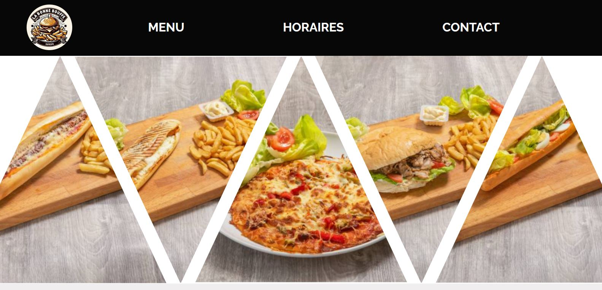

# Site vitrine Friterie "La Bonne Bouffe"

## Table des matières <!-- titre de niveau 2 car 2 # soit h2-->
1. [Information général](#Information-général-) <!-- (#...) Ancre lien vers notre info Général -->
2. [Technologies Utilisées](#technologies-utilisées)
3. [Installation](#installation)
4. [Collaboration](#collaboration)
5. [FAQS](#faqs)

### Information général <!-- titre de niveau 3 car 3 # soit h3-->
*** <!-- Ligne de séparation horizontale -->
Bienvenue dans le README de la Friterie "La Bonne Bouffe" ! Un site dédié à faire découvrir une sélection de délices croustillants, préparés avec passion et savoir-faire. celui-ci est conçu pour attirer les clients et promouvoir la friterie afin qu'il se laisse tenter.

### Présentation du site
 <!-- création d'un lien -->

### Technologies Utilisées
---

Voici les technologies que j'ai utilisées pour développer ce projet :

#### Front-end
* Vue.JS
  - HTML
  - CSS
  - JavaScript
  
## Installation
---
Pour installer et exécuter ce projet localement, suivez ces étapes :

1. Clonez le dépôt GitHub dans votre éditeur de code :
    ```
   $ git clone https://github.com/TimotheeCresson/Site_vitrine_Friterie.git
   ```

2. Assurez-vous d'inclure Vue.js dans votre projet en ajoutant le script suivant dans la section <head> de votre fichier HTML : :
   ```
   <script src="https://unpkg.com/vue@3/dist/vue.global.js"></script>
   ```
   Cette étape est cruciale pour garantir que votre projet puisse utiliser Vue.js pour la création d'interfaces utilisateur interactives.


## Collaboration
---
Si vous souhaitez contribuer à ce projet ou signaler des problèmes, voici la marche à suivre :

1. **Contribuer au code** :
    1. Forkez le projet.
    2. Créez une nouvelle branche (`git checkout -b nom-de-votre-branche`).
    3. Committer vos modifications (`git commit -am 'modification'`).
    4. Poussez vers la branche (`git push origin feature/modification`).
    5. Créez une nouvelle Pull Request.

2. **Poser des questions** :\
   Utilisez la fonctionnalité des issues GitHub pour signaler tout problème ou bug que vous rencontrez. Assurez-vous de fournir une description détaillée du problème et, si possible, des étapes pour le reproduire.
3. **Poser des questions** :\
   Si vous avez des questions sur le fonctionnement du projet, n'hésitez pas à ouvrir une issue pour poser votre question.


## Problèmes Connus
---
Voici quelques problèmes connus dans le projet :

1. **Problème de fluidité des sliders sur les appareils mobiles et tablettes** : \
   Les sliders ne fonctionnent pas de manière fluide sur les appareils mobiles ; lors des mouvements avec le doigt, ils présentent des saccades et ne répondent pas de manière optimale à l'interaction de l'utilisateur.  Voir la section [À Faire](#à-faire).

Si vous découvrez d'autres problèmes, n'hésitez pas à les signaler en ouvrant une nouvelle issue dans notre dépôt GitHub.

## Résolution des problèmes et ce que je dois faire
---
Voici quelques fonctionnalités que je prévoies d'implémenter dans le futur et les résolutions des problèmes au cours du projet :

1. **Résolution de la fluidité des sliders sur format mobile et tablettes** :
---
J'ai modifié mon script du slider en y incorporant une fonction nommé "throttle" (limitateur/régulateur), celle-ci me permettant donc de limiter la fréquence à laquelle ma fonction de rappel ("callback") peut être appelée. Elle vérifie le temps écoulé depuis la dernière fois que la fonction rappel a été appelée. Si le temps écoulé dépasse le délai spécifié, la fonction de rappel est appelée sinon elle ne fait rien. Ensuite, j'applique ma fonction "throttle" à mes différentes fonctions (this.startDrag, this.endDrag ...). Enfin, grâce à l'application de la fonction "throttle",  limite en termes de fréquence d'appel mes fonctions (this.startDrag, this.endDrag ...) afin de pouvoir gérer la fluidité des mouvements plus facilement.

Si vous avez d'autres suggestions ou idées pour améliorer le projet, n'hésitez pas à les partager en ouvrant une nouvelle issue dans notre dépôt GitHub.


## Potentielle futur modification 
---
Il est potentiellement possible par la suite que j'effectue des modifications sur mes sliders afin d'y incorporer une option où l'on pourrait modifier les images, le prix, le nom et la description directement sur ma page web sans passer par un éditeur de texte. Cela n'a pas été effectué directement car mon client étant réticent quant à la modification par lui même de potentielle changement, pour le moment, je me contenterai donc de modifier les potentielles changement de prix ou de plat.

## FAQ
---
Voici quelques questions que vous pouvez potentiellement vous poser, accompagnées de leurs réponses :

1. **En quoi consiste le projet ?** \
  _"Le projet "La Bonne Bouffe" vise à créer un site vitrine dédié à la promotion des produits proposés par la friterie. Son principal objectif est de mettre en avant les délices croustillants offerts par l'établissement, attirant ainsi de nouveaux clients et renforçant sa visibilité"_

2. **Comment puis-je contribuer à ce projet ?** \
   _"Je suis ravis que vous souhaitiez y contribuer ! Pour contribuer au projet, veuillez suivre les instructions dans la section [Collaboration](#collaboration) de ce README."_

3. **J'ai trouvé un problème dans le projet, que dois-je faire ?** \
   _"Merci de m'en tenir informés ! Veuillez signaler le bug en ouvrant une issue dans mon dépôt GitHub.(https://github.com/TimotheeCresson/Site_vitrine_Friterie.git) Assurez-vous de fournir autant de détails que possible sur le bug et, si possible, des étapes pour le reproduire."_

N'hésitez pas à poser d'autres questions en ouvrant une nouvelle issue dans mon dépôt GitHub.

